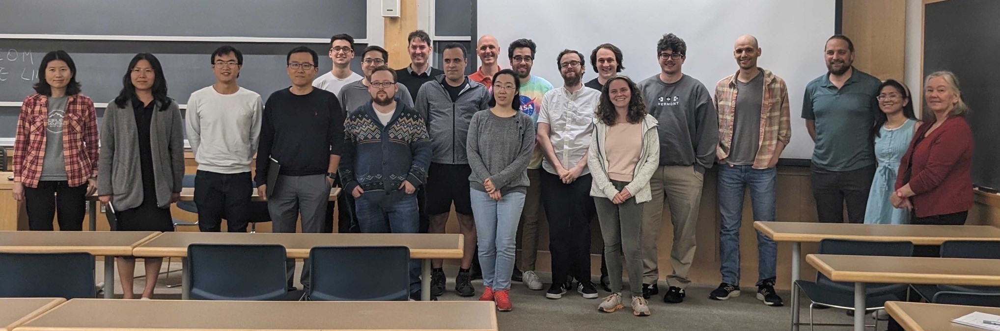

The Applied and Computational Mathematics seminar (ACMS) at Dartmouth brings together researchers with common interests in the real-world applications of mathematical models and tools to tackle the resulting numerical simulation and computational challenges. Talks, enjoyed in a casual setting, include both outside speakers. The seminar includes talks broadly on mathematics, computational science, network science, engineering, game theory, mathematical biology, statistics, physical science, complex systems, machine learning, data science, etc.; hence these talks will keep the breadth of the audience in mind.

The seminar is held weekly on Tuesdays from 2:30 -- 3:30 PM in Kemeny Hall, Room 007.

<!-- This cell looks through the seminar_talks YAML file and generates the current seminar schedule. -->

Date      Speaker                                                                                                        Title
--------  -------------------------------------------------------------------------------------------------------------  ----------------------------------------------------------------------------------------------------------------------------------------------------------------------------------------
9/12/23   [Eugene Demidenko](https://www.eugened.org/) (Dartmouth, Mathematics)                                          [M-statistics: Optimal Statistical Inference for a Small Sample](/seminar_pages/DemidenkoF23.html)
9/19/23   [Tongtong Li](https://math.dartmouth.edu/~tli/) (Dartmouth, Mathematics)                                       [A structurally informed data assimilation approach for discontinuous state variables](/seminar_pages/LiF23.html)
9/26/23   [Jacob Scott](https://case.edu/cancer/members/member-directory/jacob-scott) (Case Western Reserve University)  [Perturbing the evolutionary mechanisms and ecological forces underlying drug resistance in cancer and pathogens: evolutionary therapy and formal control](/seminar_pages/ScottF23.html)
10/3/23   [Longmei Shu](https://math.dartmouth.edu/~lshu/) (Dartmouth, Mathematics)                                      [Dynamics of bimatrix games and a social-climate model](/seminar_pages/ShuF23.html)
10/10/23  [Daniel Watkins](https://danielmwatkins.com/) (Brown)                                                          [Dynamics of coupled Arctic air-ice-ocean interactions from floe scale to basin scale](/seminar_pages/WatkinsF23.html)
10/17/23  [Heather Zinn Brooks](https://sites.google.com/g.hmc.edu/hzinnbrooks?pli=1) (Harvey Mudd)                      [Emergence of polarization in a sigmoidal bounded-confidence model of opinion dynamics](/seminar_pages/BrooksF23.html)
10/24/23  TBA (TBA)                                                                                                      [TBA](/seminar_pages/TianF23.html)
10/31/23  [Will Thompson](https://www.willhwthompson.com/) (Vermont Complex Systems Center)                              [TBA](/seminar_pages/ThompsonF23.html)
11/7/23   [Hiroki Sayama](https://bingweb.binghamton.edu/~sayama/) (Binghamton)                                          [TBA](/seminar_pages/SayamaF23.html)
11/14/23  [Georg Stadler](https://math.nyu.edu/~stadler/) (NYU)                                                          [TBA](/seminar_pages/StadlerF23.html)

This seminar is organized by Linh Huynh (linh.n.huynh@dartmouth.edu) and Jonathan Lindbloom (jonathan.t.lindbloom.gr@dartmouth.edu).

